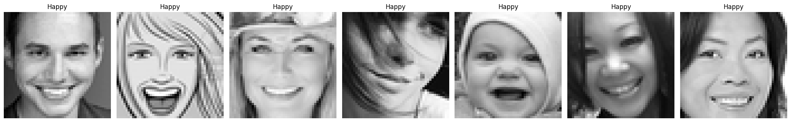

# **Customer Satisfaction Prediction Using Facial Expression Analysis**

**Ediashta Revindra Amirussalam**  
Data Analyst at WalMart .Inc

## 01. Introduction

Emotions are complex psychological states that involve feelings, thoughts, and physiological changes. Emotions can encompass positive, negative, or neutral feelings and play a crucial role in social interactions, decision-making, and psychological well-being. While facial expressions can provide clues about an individual's emotions, they aren't always reliable indicators of honesty. The concept that specific facial expressions are related to deception is based on the "microexpression theory" popularized by psychologist Paul Ekman. This theory suggests that certain brief facial expressions can reveal an individual's true emotions, even when they attempt to conceal them.

WalMart .Inc is a multinational retail corporation based in the United States, operating in the hypermarket and grocery industry. As a leading player in the retail world, WalMart aims to maintain high customer satisfaction levels to retain loyal shoppers.

To ensure ongoing customer satisfaction, WalMart plans to conduct customer satisfaction surveys every two weeks. This approach requires a swift method to collect and analyze survey results for customer insights.

As a Data Analyst at WalMart .Inc, I am tasked with developing a model to swiftly gauge customer satisfaction levels. Emotions during shopping, which can be inferred from facial expressions, serve as a metric to determine customer satisfaction. To achieve this, I will create a Convolutional Neural Network (CNN) model to predict and classify user expressions. The insights from this model can provide valuable feedback for enhancing customer experience.

**Key Findings from the Model**

Overall, the model is considered **underfit but shows good performance in predicting certain classes**. This can be attributed to several factors:
* Imbalanced data distribution, with more data in the "Happy" class and fewer in the "Disgusted" class in the training data.
* Difficulty in identifying angles in some images, affecting feature detection for certain classes.
* Incomplete handling of missing values in the dataset due to time constraints.

The best-performing model in this project is:
* Sequential API
* Utilizes 6 Convolutional Layers and 2 Dense Layers
* Total of 6 million Neurons 

With the following classification results:

              precision    recall  f1-score   support

           0       0.58      0.63      0.61       958
           1       0.68      0.55      0.61       111
           2       0.58      0.43      0.50      1024
           3       0.88      0.88      0.88      1774
           4       0.59      0.72      0.65      1233
           5       0.58      0.53      0.55      1247
           6       0.76      0.83      0.79       831

    accuracy                           0.68      7178

Based on the classification report, the model demonstrates slight underfitting and could be further improved:
* Implement transfer learning for enhanced model performance.
* Adjust training parameters and increase epochs to enable better data learning while preventing overfitting and gradient vanishing.
* Consider using the Functional API for more flexibility in training.

Predicting human expressions cannot guarantee 100% accuracy, as true expressions often lie on a spectrum, allowing for the possibility of multiple simultaneous expressions. Therefore, predictions encompass all potential expressions rather than solely the highest-probability class. An example of this can be seen in the `h8dsft_P2M2_ediashta_inference` file.

*Example: A happy facial expression is usually characterized by a joyful and satisfied feeling. It involves a smiling mouth, sparkling eyes, and an open and friendly appearance.*

**Physical Characteristics of Happiness:**
* Eyes appear bright and lively.
* Mouth forms a smile.

